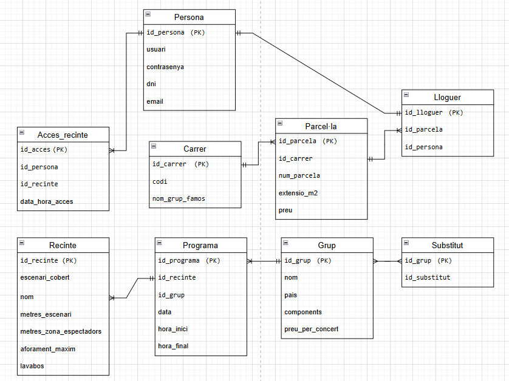

Esta base de datos gestiona la organización de un festival de música, abarcando recintos, grupos musicales, programación de actuaciones, zona de acampada y asistencia del público. Incluye:
- Recintos: Información de cada área de actuación, incluyendo aforo y características.
- Grupos Musicales: Datos de los grupos, sus honorarios y posibles sustitutos.
- Zona de Acampada: Estructura de calles y parcelas para el alojamiento del público.

Diseño de la base de datos:

